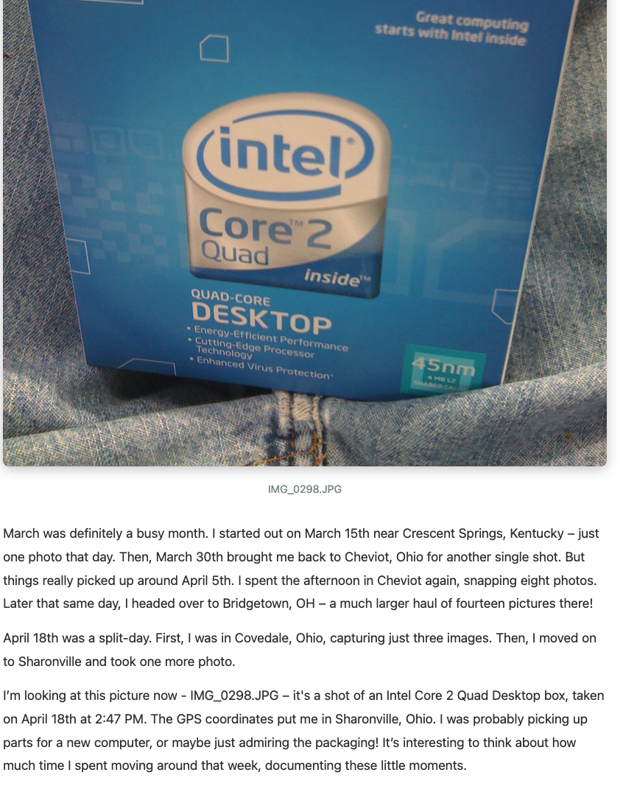

# Image History - Photo Metadata Extractor & Map-Based Storyteller 🗺️

**Extract EXIF metadata from your photo collection, build a SQLite database with geocoding, and create an interactive map-based storyteller that follows your journey through locations with image galleries.**



> **Perfect for visualizing your photo journey through time and space with an interactive map interface.**

## 🌟 What Makes This Awesome?

This project extracts comprehensive EXIF metadata from your photo collection and creates an interactive map-based storyteller:

1. **Extract EXIF metadata** from thousands of photos (GPS, camera settings, timestamps)
2. **Geocode locations** using Geonames database for accurate place names
3. **Build interactive map** showing your photo journey through locations
4. **Navigate chronologically** through locations with image galleries

### ~~AI Story Generation~~ (TBD - On the Shelf)

~~The project previously included AI-powered story generation using vision-capable LLMs. This feature is currently on hold and may be revisited in the future.~~

### Current Focus: Map-Based Storytelling

- 🗺️ **Interactive Map**: Visualize your photo journey through locations
- 📸 **Image Galleries**: Browse photos by location in chronological order
- 🧭 **Location Navigation**: Click "next" to follow your path through time
- 📊 **Data-Driven**: All based on actual GPS coordinates and EXIF metadata

## 🎯 Use Cases

- **Personal Photo Archives**: Visualize years of photos on an interactive map
- **Travel Journals**: See your journey through locations with image galleries
- **Location Analysis**: Understand where and when you took photos
- **Chronological Exploration**: Follow your path through time and space

## 🚀 Quick Start

### 1. Extract EXIF Data & Build Database

```bash
# Process your photo folder
python app.py process --folder /path/to/your/photos

# The database filename is auto-derived from folder name
# Example: /path/to/library7/ → library7.db
```

### 2. ~~Generate AI Stories~~ (TBD - On the Shelf)

~~This feature is currently on hold.~~

### 3. View Your Stories in Web Interface

```bash
# Start Flask web server
python story_viewer.py

# Open browser to http://127.0.0.1:5000
# Browse your photo stories with image previews!
```

## 📖 Features

### EXIF Metadata Extraction (`app.py`)

- ✅ **Comprehensive EXIF parsing**: Camera model, lens, ISO, aperture, exposure, GPS coordinates
- ✅ **Geocoding integration**: Automatic location lookup from GPS using Geonames database
- ✅ **Fault tolerance**: Resume processing, skip already-processed files, error tracking
- ✅ **Smart change detection**: Automatically reprocesses modified files
- ✅ **Progress tracking**: Saves every 500 images, handles interruptions gracefully
- ✅ **Multiple formats**: JPG, PNG, TIFF, RAW, HEIC, and more
- ✅ **CSV export**: Flexible grouping by day, location, or both for data analysis

### ~~AI Story Generation~~ (`story_agent.py`) - TBD, On the Shelf

~~- ✅ Generate travel narratives from photo metadata using LLMs~~
~~- ✅ Integrate with LMStudio and OpenAI-compatible APIs~~
~~- ✅ Vision model support (base64 image encoding for JPG/PNG)~~
~~- ✅ Data-driven story generation (structured data logs prevent hallucination)~~
~~- ✅ Location and date-based photo chunking~~
~~- ✅ Context-aware narrative generation (maintains story continuity)~~

**Status**: This feature is currently on hold. Focus has shifted to map-based storytelling.

### Web Story Viewer (`story_viewer.py`)

- ✅ **Flask-based web application**: Responsive design, modern UI
- ✅ **Chronological index**: Browse all stories sorted by date
- ✅ **Image previews**: Automatic photo lookup and display
- ✅ **Individual story pages**: Full narrative with metadata
- ✅ **Markdown rendering**: Clean story presentation
- ✅ **Photo serving**: Direct image links from your photo archive

### 🗺️ Map-Based Storyteller (Planned)

- [ ] **Interactive map visualization**: Show photo locations on a map
- [ ] **Location path**: Connect locations chronologically to show journey
- [ ] **Image galleries**: Display all photos for each location
- [ ] **Navigation controls**: "Next" button to move to next location chronologically
- [ ] **Timeline integration**: Show date/time information for each location
- [ ] **Location clustering**: Group nearby photos by location
- [ ] **Route visualization**: Draw path between locations in chronological order

## 🛠️ Installation

### Requirements

```bash
# Core dependencies
pip install exifread flask

# Optional: For better markdown rendering
pip install markdown
```

### Geonames Database (Optional)

Download `cities500.txt` from [Geonames](https://www.geonames.org/) for location lookup. The script will automatically import it into the database on first run.

## 📚 Detailed Usage

### EXIF Extraction & Database Building

```bash
# Basic usage
python app.py process --folder /path/to/photos

# Force reprocess all files
python app.py process --folder /path/to/photos --force-reprocess

# Skip location lookup (faster)
python app.py process --folder /path/to/photos --skip-location

# Custom database name
python app.py process --folder /path/to/photos --db my_photos.db
```

### CSV Export for Analysis

```bash
# Export all data
python app.py export

# Group by day and location
python app.py export --group-by-day --group-by-location

# Custom output file
python app.py export --output analysis.csv --group-by-day
```

### ~~AI Story Generation~~ (TBD - On the Shelf)

~~This feature is currently on hold.~~

### Web Viewer

```bash
# Start Flask server
python story_viewer.py

# Server runs on http://127.0.0.1:5000
# Navigate to index page to see all stories
```

**Configure photo path** in `story_viewer.py`:
```python
PHOTOS_BASE_PATH = '/path/to/your/photos'
```

## 🗄️ Database Schema

The SQLite database contains a `photos` table with:

- **Metadata**: `filename`, `filepath`, `datetime`, `camera_model`, `lens_model`
- **Camera settings**: `iso`, `fnumber`, `exposure_time`, `focal_length`
- **Location data**: `gps_lat`, `gps_lon`, `location` (geocoded name)
- **Processing status**: `status`, `file_hash`, `file_mtime`, `processed_at`, `error_message`

Plus a `locations` table for fast geocoding lookups (auto-imported from `cities500.txt`).

## 🗺️ Map-Based Storytelling (Planned)

### Vision

Create an interactive map-based storyteller that:

1. **Displays locations on a map**: All photo locations plotted with markers
2. **Shows chronological path**: Connects locations in time order
3. **Image galleries per location**: Click a location to see all photos taken there
4. **Navigation controls**: "Next" button moves to the next location chronologically
5. **Timeline integration**: Shows date/time for each location visit

### Technical Approach

- Use a mapping library (Leaflet, Mapbox, Google Maps)
- Query database for unique locations sorted by first photo date
- Group photos by location
- Create chronological path between locations
- Build image galleries for each location
- Implement navigation to move through locations in time order

## 🎨 Web Interface Features

The Flask viewer (`story_viewer.py`) currently provides:

- **Index Page**: Chronological list of all stories with metadata
- **Story Pages**: Individual narratives with image previews
- **Image Serving**: Direct links to photos from your archive
- **Responsive Design**: Works on desktop and mobile
- **Error Handling**: Graceful handling of missing photos


*Current web interface - map-based storyteller coming soon!*

## 🔧 Configuration

### Photo Path Configuration

Update `PHOTOS_BASE_PATH` in `story_viewer.py` to point to your photo archive:

```python
PHOTOS_BASE_PATH = '/Volumes/E1999/photos_backup'
```

## 🐛 Troubleshooting

### Photos Not Found in Web Viewer

- Check `PHOTOS_BASE_PATH` in `story_viewer.py`
- Ensure photo filenames match exactly (case-sensitive on some systems)
- Photos are searched recursively in the base path

### Location Lookup Issues

- Download `cities500.txt` from Geonames
- Location data auto-imports on first run (may take 1-2 minutes)
- Photos without GPS will have `NULL` location

## 📊 Performance

- **EXIF extraction**: ~100-500 images/second (depends on file size)
- **Location lookup**: Fast after initial database import (uses spatial indexes)
- **Web viewer**: Instant page loads, fast image serving

## 🎓 For Developers

This project demonstrates:

- **EXIF metadata extraction**: Comprehensive photo data parsing
- **Geocoding integration**: Real-world location intelligence
- **Fault-tolerant processing**: Production-ready error handling
- **Web interface design**: Flask-based photo presentation
- **Database optimization**: Spatial indexing for fast location queries

**Perfect for:**
- Building photo management systems
- Learning EXIF data extraction
- Understanding geocoding and location services
- Creating map-based visualizations
- Building chronological photo explorers

## 📝 License & Credits

- Uses [Geonames](https://www.geonames.org/) database for location data
- Built with Python, Flask, SQLite

## 🤝 Contributing

This is a personal project, but feel free to:
- Fork and adapt for your own photo collections
- Build the map-based storyteller feature
- Add additional visualization features
- Share your implementations!

## 🔗 Related Projects

Looking for more photo management projects? Check out:
- Photo metadata extraction tools
- Geocoding and location services
- Map visualization libraries (Leaflet, Mapbox)
- Chronological data presentation tools

---

**Transform your photo collection into an interactive map-based journey through your locations!** 🗺️

*Follow your path through time and space with image galleries at each location.*
