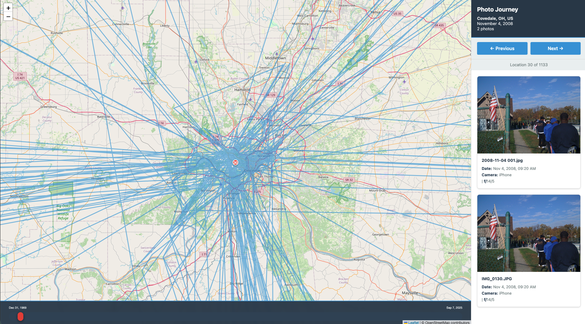

# Image History - Interactive Map Timeline Photo Browser 🗺️📸

**Build a beautiful Flask-based interactive map timeline to browse your photo collection through time and space. Navigate your photo journey chronologically with an intuitive timeline slider, map visualization, and image galleries.**



> **Perfect for visualizing your photo collection as an interactive journey through locations and time with a modern web interface.**

## 🌟 What Makes This Awesome?

This project creates an **interactive map-based photo browser** that transforms your photo collection into a visual journey:

1. **Extract EXIF metadata** from thousands of photos (GPS, camera settings, timestamps)
2. **Geocode locations** using Geonames database for accurate place names
3. **Build interactive map timeline** showing your photo journey through locations
4. **Navigate chronologically** with a draggable timeline slider and image galleries

### Why Developers Love This

- 🗺️ **Interactive Map Visualization**: Leaflet.js map showing all photo locations with paths
- ⏱️ **Timeline Navigation**: Drag the timeline slider to fly through your journey in time
- 📸 **Image Galleries**: Browse photos by location/day with full EXIF metadata
- 🎨 **Beautiful Flask UI**: Modern, responsive web interface
- 🔄 **Fault-Tolerant Processing**: Resume capability, error handling, progress tracking
- 📊 **Data-Driven**: All based on actual GPS coordinates and EXIF metadata

## 🎯 Use Cases

- **Personal Photo Archives**: Visualize years of photos on an interactive map timeline
- **Travel Journals**: See your journey through locations with chronological navigation
- **Location Analysis**: Understand where and when you took photos over time
- **Photo Management**: Browse and explore large photo collections visually
- **Timeline Visualization**: Experience your photos as a journey through space and time

## 🚀 Quick Start

### 1. Extract EXIF Data & Build Database

```bash
# Process your photo folder
python app.py process --folder /path/to/your/photos

# The database filename is auto-derived from folder name
# Example: /path/to/library7/ → library7.db
```

### 2. Launch Interactive Map Timeline Browser

```bash
# Start Flask map storyteller
python map_storyteller.py --db library7.db --photos-path /Volumes/E1999/photos_backup

# Open browser to http://127.0.0.1:5001
# Drag the timeline slider to navigate through your photo journey!
```

## 📖 Features

### EXIF Metadata Extraction (`app.py`)

- ✅ **Comprehensive EXIF parsing**: Camera model, lens, ISO, aperture, exposure, GPS coordinates
- ✅ **Geocoding integration**: Automatic location lookup from GPS using Geonames database
- ✅ **Fault tolerance**: Resume processing, skip already-processed files, error tracking
- ✅ **Smart change detection**: Automatically reprocesses modified files
- ✅ **Progress tracking**: Saves every 500 images, handles interruptions gracefully
- ✅ **Multiple formats**: JPG, PNG, TIFF, RAW, HEIC, and more
- ✅ **CSV export**: Flexible grouping by day, location, or both for data analysis

### Interactive Map Timeline Browser (`map_storyteller.py`)

- ✅ **Leaflet.js Map**: Interactive map showing all photo locations
- ✅ **Timeline Slider**: Draggable timeline at bottom of map for chronological navigation
- ✅ **Location Paths**: Visual paths connecting locations in chronological order
- ✅ **Image Galleries**: Browse all photos for each location/day combination
- ✅ **EXIF Metadata Display**: Camera model, lens, ISO, aperture, exposure time, focal length
- ✅ **Smooth Map Flying**: Map automatically flies to locations as you navigate
- ✅ **Keyboard Navigation**: Arrow keys to move through locations
- ✅ **Click to Jump**: Click anywhere on timeline to jump to that point in time
- ✅ **Touch Support**: Works on mobile devices with touch gestures
- ✅ **Responsive Design**: Beautiful UI that works on desktop and mobile

### Web Story Viewer (`story_viewer.py`)

- ✅ **Flask-based web application**: Responsive design, modern UI
- ✅ **Chronological index**: Browse all stories sorted by date
- ✅ **Image previews**: Automatic photo lookup and display
- ✅ **Individual story pages**: Full narrative with metadata
- ✅ **Markdown rendering**: Clean story presentation
- ✅ **Photo serving**: Direct image links from your photo archive

## 🛠️ Installation

### Requirements

```bash
# Core dependencies
pip install exifread flask

# Optional: For better markdown rendering
pip install markdown
```

### Geonames Database (Optional)

Download `cities500.txt` from [Geonames](https://www.geonames.org/) for location lookup. The script will automatically import it into the database on first run.

## 📚 Detailed Usage

### EXIF Extraction & Database Building

```bash
# Basic usage
python app.py process --folder /path/to/photos

# Force reprocess all files
python app.py process --folder /path/to/photos --force-reprocess

# Skip location lookup (faster)
python app.py process --folder /path/to/photos --skip-location

# Custom database name
python app.py process --folder /path/to/photos --db my_photos.db
```

### CSV Export for Analysis

```bash
# Export all data
python app.py export

# Group by day and location
python app.py export --group-by-day --group-by-location

# Custom output file
python app.py export --output analysis.csv --group-by-day
```

### Interactive Map Timeline Browser

```bash
# Basic usage
python map_storyteller.py --db library7.db

# Custom photos path
python map_storyteller.py --db library7.db --photos-path /path/to/photos

# Custom host and port
python map_storyteller.py --db library7.db --host 0.0.0.0 --port 8080
```

**Features:**
- **Timeline Slider**: Drag the red handle at the bottom of the map to navigate through time
- **Click Timeline**: Click anywhere on the timeline track to jump to that date
- **Next/Previous Buttons**: Navigate through locations sequentially
- **Keyboard Shortcuts**: Use arrow keys (← →) to navigate
- **Map Flying**: Map smoothly flies to each location as you navigate
- **Photo Galleries**: View all photos for each location/day with full metadata

### Web Viewer

```bash
# Start Flask server
python story_viewer.py

# Server runs on http://127.0.0.1:5000
# Navigate to index page to see all stories
```

**Configure photo path** in `story_viewer.py`:
```python
PHOTOS_BASE_PATH = '/Volumes/E1999/photos_backup'
```

## 🗄️ Database Schema

The SQLite database contains a `photos` table with:

- **Metadata**: `filename`, `filepath`, `datetime`, `camera_model`, `lens_model`
- **Camera settings**: `iso`, `fnumber`, `exposure_time`, `focal_length`
- **Location data**: `gps_lat`, `gps_lon`, `location` (geocoded name)
- **Processing status**: `status`, `file_hash`, `file_mtime`, `processed_at`, `error_message`

Plus a `locations` table for fast geocoding lookups (auto-imported from `cities500.txt`).

## 🗺️ Map Timeline Browser Features

### How It Works

1. **Groups photos by day and location**: Each unique combination of date and location is a stop on your journey
2. **Chronological ordering**: Locations are sorted by the first photo taken at that location/day
3. **Interactive timeline**: Drag the slider to navigate through your entire photo journey
4. **Map visualization**: See all locations plotted on a map with paths connecting them
5. **Image galleries**: Click through photos for each location with full EXIF metadata

### Navigation Methods

- **Timeline Slider**: Drag the red handle left/right to move through time
- **Click Timeline**: Click anywhere on the timeline track to jump to that point
- **Next/Previous Buttons**: Step through locations one at a time
- **Keyboard**: Use left/right arrow keys to navigate
- **Touch**: On mobile, drag the timeline handle with touch gestures

### Visual Features

- **Location Markers**: Numbered red markers show your current position
- **Path Lines**: Blue lines connect all locations in chronological order
- **Timeline Labels**: Shows start and end dates of your journey
- **Location Counter**: Displays current position (e.g., "Location 30 of 1133")
- **Photo Metadata**: Full EXIF data including camera, lens, ISO, aperture, exposure

## 🎨 Web Interface Features

The Flask map timeline browser provides:

- **Full-Screen Map**: Interactive Leaflet.js map with OpenStreetMap tiles
- **Sidebar Gallery**: Photo gallery with thumbnails and metadata
- **Timeline Overlay**: Draggable timeline at bottom of map
- **Responsive Design**: Works on desktop and mobile devices
- **Smooth Animations**: Map flies smoothly between locations
- **Error Handling**: Graceful handling of missing photos


*Interactive map timeline showing your photo journey through locations and time*

## 🔧 Configuration

### Photo Path Configuration

Update `PHOTOS_BASE_PATH` in `map_storyteller.py` to point to your photo archive:

```python
PHOTOS_BASE_PATH = '/Volumes/E1999/photos_backup'
```

Or pass it as a command-line argument:
```bash
python map_storyteller.py --db library7.db --photos-path /path/to/photos
```

## 🐛 Troubleshooting

### Photos Not Found in Map Browser

- Check `--photos-path` argument or `PHOTOS_BASE_PATH` in `map_storyteller.py`
- Ensure photo filenames match exactly (case-sensitive on some systems)
- Photos are searched recursively in the base path

### Timeline Not Showing Dates

- Verify database has datetime values in correct format
- Check browser console for JavaScript errors
- Ensure locations are loaded (check Network tab for `/api/locations`)

### Location Lookup Issues

- Download `cities500.txt` from Geonames
- Location data auto-imports on first run (may take 1-2 minutes)
- Photos without GPS will have `NULL` location

## 📊 Performance

- **EXIF extraction**: ~100-500 images/second (depends on file size)
- **Location lookup**: Fast after initial database import (uses spatial indexes)
- **Map timeline**: Smooth navigation even with thousands of locations
- **Image loading**: Lazy loading of photos as you navigate

## 🎓 For Developers

This project demonstrates:

- **Flask web applications**: Building interactive web interfaces
- **Leaflet.js integration**: Creating interactive maps with custom overlays
- **EXIF metadata extraction**: Comprehensive photo data parsing
- **Geocoding integration**: Real-world location intelligence
- **Fault-tolerant processing**: Production-ready error handling
- **Database optimization**: Spatial indexing for fast location queries
- **Timeline UI components**: Building custom interactive controls

**Perfect for:**
- Learning Flask web development
- Building photo management systems
- Understanding EXIF data extraction
- Creating map-based visualizations
- Building chronological data browsers
- Learning interactive timeline interfaces

## 📝 License & Credits

- Uses [Geonames](https://www.geonames.org/) database for location data
- Uses [Leaflet.js](https://leafletjs.com/) for map visualization
- Uses [OpenStreetMap](https://www.openstreetmap.org/) for map tiles
- Built with Python, Flask, SQLite

## 🤝 Contributing

This is a personal project, but feel free to:
- Fork and adapt for your own photo collections
- Build additional visualization features
- Add timeline enhancements
- Share your implementations!

## 🔗 Related Projects

Looking for more photo management projects? Check out:
- Photo metadata extraction tools
- Geocoding and location services
- Map visualization libraries (Leaflet, Mapbox)
- Timeline and chronological data presentation tools
- Flask web application examples

---

**Transform your photo collection into an interactive map timeline journey!** 🗺️📸

*Navigate through your photos in time and space with a beautiful web interface.*
